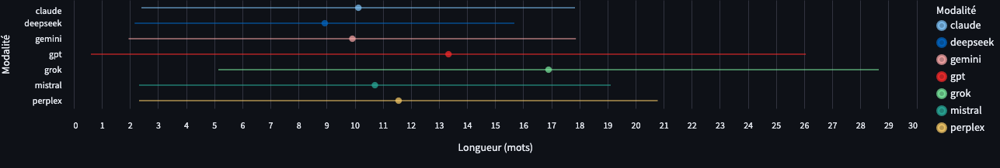

# Calcul de l'écart-type dans l'onglet « hash »

## Étapes de segmentation
- Le texte est d'abord nettoyé des éventuelles lignes de métadonnées puis découpé en segments à l'aide d'une regex qui repère les connecteurs (et, selon le mode choisi, la ponctuation forte). Seuls les segments réellement bordés par un connecteur sont conservés. Chaque segment est ensuite tokenisé soit par une regex `\b\w+\b` (comportement de base), soit par le tokenizer spaCy du modèle `fr_core_news_md` pour ignorer automatiquement ponctuation et espaces.
- La Longueur Moyenne des Segments (LMS) correspond à la moyenne simple des longueurs en mots de ces segments. Elle est affichée avec l'écart-type dans l'onglet « hash ».
  
## Calcul statistique
- La liste des longueurs de segments est passée à `_mean_and_std`, qui la convertit en tableau NumPy de flottants puis renvoie la moyenne et l'écart-type via `np.mean` et `np.std` (écart-type de population). Pour une liste vide, la fonction retourne `(0.0, 0.0)`.
- Le calcul final de l'onglet « hash » appelle `compute_length_standard_deviation`, lequel orchestre l'extraction des longueurs et le calcul statistique en une seule étape pour fournir la paire (LMS, écart-type).

## Lecture du graphique « Dispersion des longueurs (moyenne ± écart-type) »
- Chaque ligne horizontale est une barre d'erreur qui s'étend de **LMS − écart-type** (borne inférieure) à **LMS + écart-type** (borne supérieure) pour la modalité considérée. Ces bornes sont calculées en retranchant et en ajoutant l'écart-type à la Longueur Moyenne des Segments, avec un plancher à 0 pour éviter les valeurs négatives.
- Le **point coloré** placé sur chaque ligne correspond à la **LMS** de la modalité ; la couleur identifie la modalité et le tooltip affiche la moyenne, l'écart-type et le nombre de segments comptés.
- La LMS elle-même est la moyenne simple des longueurs (en mots) des segments obtenus après nettoyage et tokenisation du texte ; elle est calculée en même temps que l'écart-type pour chaque modalité.
- En résumé, la **longueur du trait** représente l'intervalle « moyenne ± écart-type » des longueurs de segments pour une modalité donnée, et le **point** indique où se situe la moyenne dans cet intervalle.

